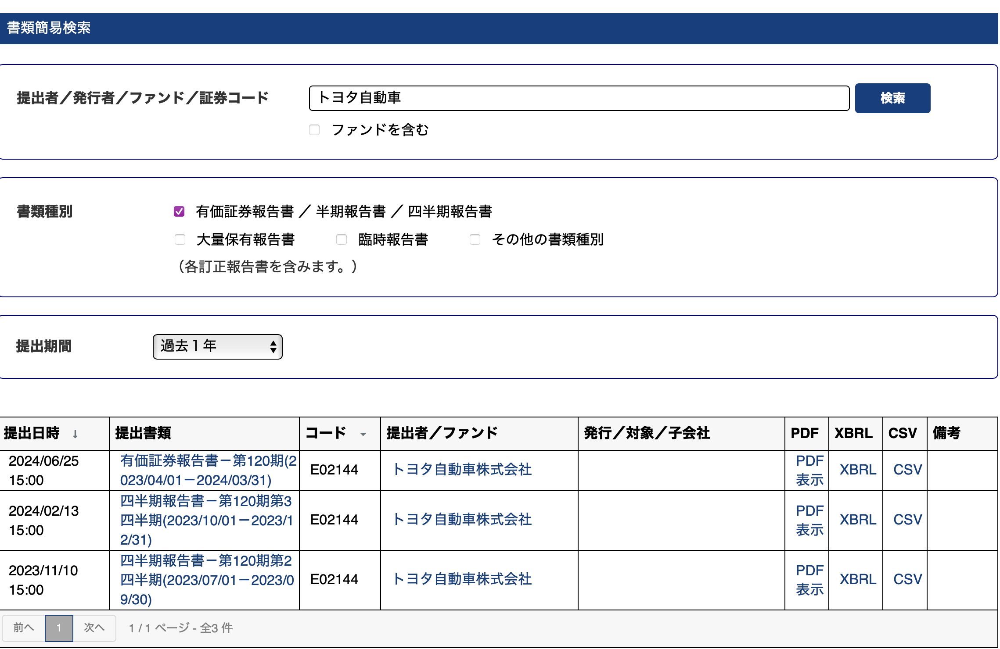
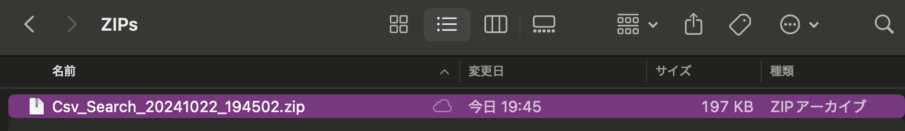
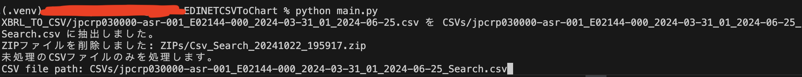
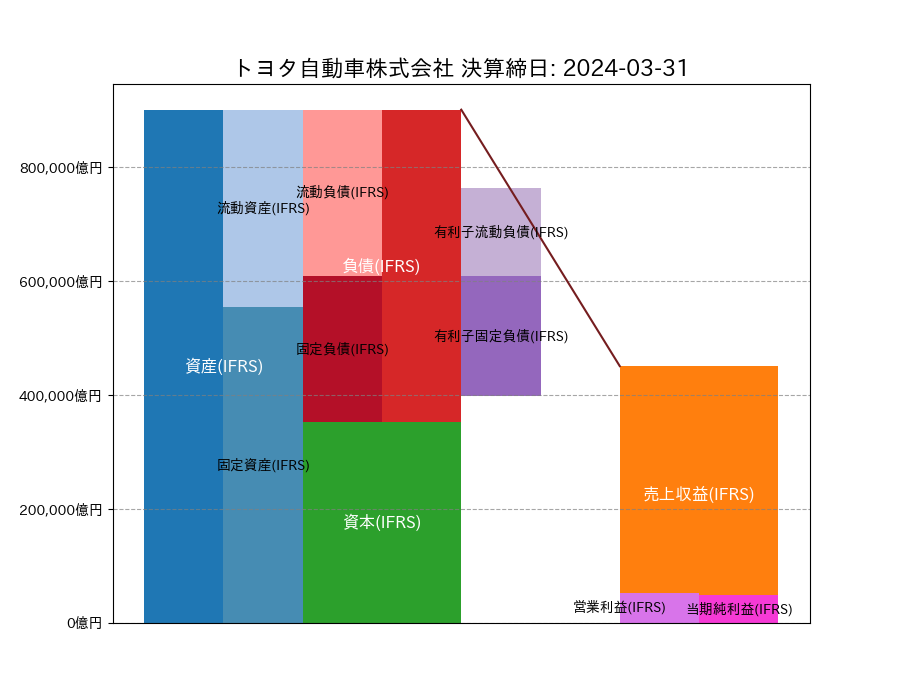

# EDINETCSVToChart

このプログラムは、EDINETで取得できる有価証券報告書のCSVファイルから必要なデータを抜き出してJSONファイルに変換し、さらにそのデータを用いて棒グラフを生成するPythonプログラムです。

## 構成

- `main.py`: メインの処理を行うスクリプト。
- `fetch_data/edinet_data_fetcher.py`: EDINETからデータを取得するスクリプト。
- `fetch_data`: EDINET_APIを用いたデータの自動取得に関連するファイルを格納するディレクトリ。
    - `fetch_data/fetch_anual_data.py`: `edinet_data_fetcher.py`を使用してその年の指定した区間のデータを取得するスクリプト。
    - `fetch_data/fetch_daily_data.py`: `edinet_data_fetcher.py`を使用して当日のデータを取得するスクリプト。シェバンを使用して直接実行可能にしています。
    - `fetch_data/fetch_weekly_data.py`: `edinet_data_fetcher.py`を使用してその週のデータを取得するスクリプト。
- `web_app/`: ウェブアプリケーション関連のファイルを格納するディレクトリ。
    - `app.py`: ウェブアプリケーションのエントリーポイントとなるスクリプト。
    - `templates/`: HTMLテンプレートファイルを格納するディレクトリ。
    - `static/`: CSSやJavaScriptなどの静的ファイルを格納するディレクトリ。
- `plot.py`: 棒グラフを生成するためのスクリプト。
- `config.json`: 設定ファイル。
- `requirements.txt`: 必要なPythonパッケージを記載したファイル。
- `.gitignore`: Gitで無視するファイルやディレクトリを記載したファイル。
- `CSVs/`: 処理されたCSVファイルを格納するディレクトリ。
- `ZIPs/`: ダウンロードされたZIPファイルを格納するディレクトリ。
- `json_file/`: 生成されたJSONファイルを格納するディレクトリ。

### シェバン(Shebang)について

`fetch_data/fetch_daily_data.py`では毎日自動的にデータを集めたい状況を考えて、先頭にシェバン（shebang）が書かれています。
シェバンはスクリプトを実行するインタプリタを指定するためのもので、Macでは次のように記述します。
```python
#!/usr/bin/env python3
```

## インストール

1. リポジトリをクローンします。

    ```sh
    git clone https://github.com/SushiLovinnn/EDINETCSVToChart/
    cd EDINETCSVToChart
    ```

2. 必要なパッケージをインストールします。

    ```sh
    pip install -r requirements.txt
    ```

## 使い方(EDINET_APIを使わない場合)
トヨタ自動車の有価証券報告書を例として、使い方を解説します。
1. `config.json`を編集して設定を行います。
    ```json
    {
        "select_data": true,
        "show_chart": true,
        "process_unprocessed_csv_only": true
    }
    ```
    - `select_data`: `true`に設定すると、個別のCSVファイルを選択します。`false`に設定すると、CSVs内の全てのCSVファイルを処理します。
    - `show_chart`: `true`に設定すると、棒グラフを表示します。
    - `process_unprocessed_csv_only`: `true`に設定すると、まだ処理していない(=データを抽出してjsonファイルにデータを格納していない)CSVファイルのみに対して処理を行います。
2. [EDINET(簡易書類検索)](https://disclosure2.edinet-fsa.go.jp/)からCSVデータをダウンロードします。
    
    
    
    このプログラムは有価証券報告書にのみ対応しているので、有価証券報告書のCSVファイルをダウンロードしてください。

    

    ダウンロードしたファイルはZIPファイルになっているはずです。これを解凍せずにクローン先のZIPsディレクトリに入れてください。
3. プログラムを実行します。

    ```sh
    python main.py
    ```
    
    
    
    `select_data`が`true`の場合、`AをBに抽出しました`と表示されて、CSVファイルのパスが求められるので、Bをコピペして入力してください。`select_data`が`false`の場合はCSVsディレクトリ内のCSVファイルが自動的に読み込まれます。
    そして、次のような目的の図が表示されます。

    

## ライセンス
このプロジェクトはMITライセンスの下で公開されています。